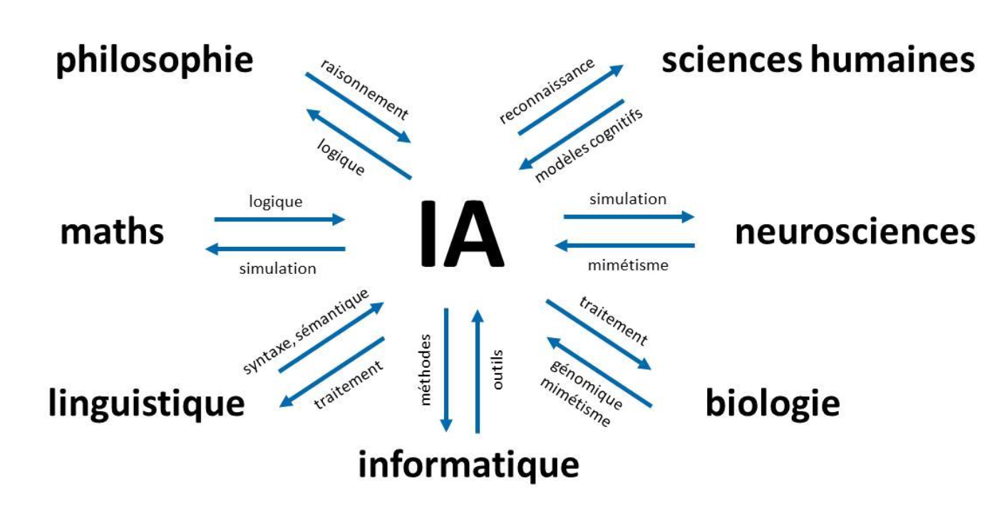
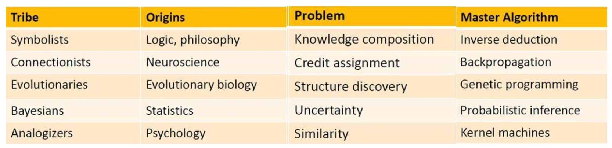
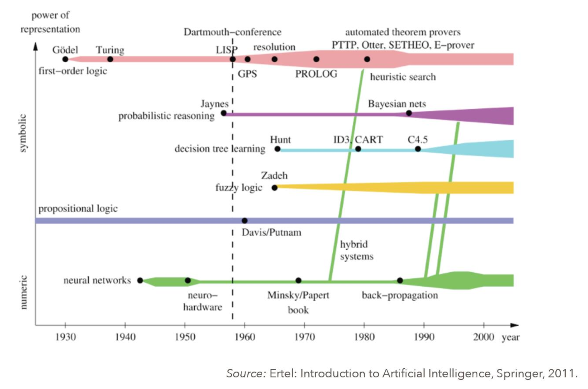
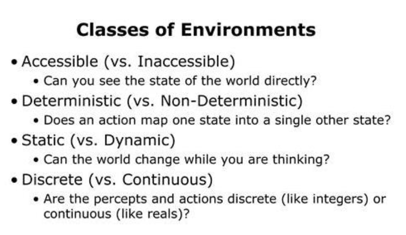

Histoire et sémantique de l’IA

Comme tout domaine scientifique complexe, l’IA n’a jamais été un terrain d’unanimité et cela risque de perdurer. Diverses écoles de pensée se disputent sur les approches à adopter.

Citer : (Ezratty, 2018)

  

  

biblio: Ezratty, O. (2018). _Les usages de l’intelligence artificielle_. 522.

Méthodes statistiques

Raisonnement automatique

Le raisonnement automatique fait partie du vaste champ de l’IA symbolique appliquant de la logique formelle.

Le cerveau met d’ailleurs en œuvre une logique bayésienne pour ses propres prises de décision

Il existe des problèmes trop complexes pour les ordinateur

Dictionnaire anglais/français de l’IA

Deep learning

Réseaux de neurones convolutionnel

Les technologies et méthodes de l’IA sont méconnues ou assimilées à tors et à travers, y compris par la majorité des professionnels du numérique, d’où la propagation de nombreux mythes à son sujet, un peu trop directement inspirés par la science-fiction ou par les thèses singularistes.

On croit par exemple que le «deep learning » ou « apprentissage profond » raisonne alors qu’il ne fait qu’appliquer, en général, des modèles probabilistes.

comprendre les usages et techniques de l’IA dans les entreprises et les aider à en tirer le meilleur parti

Leur création et inté- gration est encore une affaire de bricolage et de tâtonnements, si ce n’est d’un véritable artisanat.

Chercher un "expert en IA" 3 revient maintenant à demander "un expert en logiciels" ou un "expert en informatique" sans compter le top avec "l’expert en transformation digitale".

de nombreux outils de développement et d’intégration arrivent sur le marché qui permettent à des développeurs moins qualifiés, voire même à des cadres, de créer eux-mêmes des solutions intégrant des briques d’IA.

Comment se préparer au niveau des compétences ?

Comment intégrer l’IA dans les autres dynamiques d’innovations liées au numérique ?

Comment va évoluer le métier de développeur ?

Pour certains, seul le deep learning est digne de faire partie de l’IA et le machine learning et même les moteurs de règles, pas du tout.

Certaines ont une dimension anthropomorphique comme la vision artificielle

identifier des corrélations, des tendances ou faire des prévisions

----

TensorFlow

PyTorch

scikit-learn

Keras

L’ histoire moderne de l’intelligence artificielle a cependant véritablement démarrée au moment du Summer Campde Darmouth, organisé entre le 18 juin et le 17 août 1956

Elle recouvre les sciences et technologies qui permettent d’imiter, d’étendre et/ou d’augmenter l’intelligence humaine avec des machines.

L’expression « intelligence artificielle » fut couchée sur papier le 31 août 1955

L’IA est en fait une appellation créée par un chercheur afin de faire parler de son domaine et lui permettant d’éviter d’être assimilé à des disciplines voisines comme les mathématiques, les statistiques ou l’informatique.

L’IA a atteint l’âge de la retraite mais est encore adolescente et brouillonne.

[...] notion d’intelligence augmenté (Champlain, 2018)

parfois dépasse largement des composantes isolées de l’intelligence humaine

d’intelligence humaine augmentée

Dans le domaine du raisonnement automatisé, l’IA est censée apporter une rationnalité dont l’Homme ne fait pas toujours preuve. Là encore, nous somme s dans l’ordre de la complémentarité.

Celle-ci (IH) est encore unique dans la capacité à réagir avec discernement face à des situations nouvelles, à tirer profit de circonstances fortuites, à discerner le sens de messages ambigus ou contradictoires, à juger de l'importance relative de différents éléments d'une situation, à trouver des similitudes entre des situations malgré leurs différences, à établir des distinctions entre des situations malgré leurs similitudes, à synthétiser de nouveaux concepts malgré leurs différences ou à trouver de nouvelles idées

Vincent Champain, avril 2018 qui évoque cette notion d’intelligence augmentée

réseaux de neurones pour la reconnaissance des formes,

systèmes experts

[...] langage LISP qui servit pendant plusieurs décennies à développer des solutions logicielles d’IA travaillant en logique formelle et à base de règles.

stade de l’AGI (IA général iste).

[...]  l’IA symbolique, [...] Il recouvre diverses techniques de modélisation des connaissances et du raisonnement.

**Premiers chatbots**

On vit aussi apparaître les ancêtres de catégories de solutions d’IA courantes aujourd’hui avec l’un des premiers chatbots, simulant un dialogue avec un psy, ELIZA entre 1964 et 1966 .

transhumanisme

----

Promesse non-tenues  

systèmes experts

----

L’augmentation de la puissance du matériel qui a permis de diversifier la mise en œuvre de nombreuses méthodes jusqu’alors inaccessibles.

IA connexionniste

Les chercheurs doivent publier des exemples de codes sources pour illustrer leurs méthodes, sur Github qui peuvent alors être reproduits et vérifiés par la communauté des chercheurs et développeurs.

Les nombreuses applications commerciales de l’IA mêlant le machine learning, les objets connectés, la mobilité et le big data

[...] connexionnisme avec apprentissage par essais-erreurs ou par renforcement

Connexionisme et symbolisme

Les partisans du connexionnisme

Les partisans du symbolisme

le raisonnement inductif qui réalise des prévisions et des généralisations à partir d’observations .

L’IA symbolique modélise le raisonnement logique et représente les connaissances avec des objets et des symboles formels les associant entre eux (appartient à, fait partie de, est équivalent à, ...). C’est un raisonnement déductif qui s’appuie sur la logique reposant sur des faits et règles connu.

On utilise la logique connexionniste lorsque l’on ne peut pas modéliser un système complexe avec des règles établies ou bien, lorsque ces règles changent très souvent et rapidement [...]

[...] le fonctionnement de l’intelligence humaine est toujours l’objet de désaccords scientifiques

langages de programmation déclaratifs

moteurs d’inférences

moteurs d’inférences utilisant des bases de règles

Glossaire

anthropomorphique, adjectif

Qui a rapport à l'anthropomorphisme (tendance à attribuer aux animaux et aux choses des réactions humaines).

Qu'est-ce qu'une **méthodes statistiques** ?

Qu'est-ce qu'un **réseaux bayésiens** ?

Qu'est-ce que le **TDNN** (Time d elay neural networks) d'Alexandre Waibel ?

Il y a cinq grands courants dans l'IA

----

Les 5 grand courrants de l'IA.  

En pratique, de nombreux chercheurs ambitionnent de fusionner les approches symboliques et connexionnistes pour gérer du raisonnement automatique

L’IA est un ensemble de techniques permettant de résoudre des problèmes complexes en s’inspirant de mécanismes cognitifs humains, agissant de manièrerationnelle en fonction de faits,données et expériences, et capables d’atteindre de manière  optimaleun ou plusieurs objectifs donnés.

Cette rationalité est habituellement limitée par notre volonté, le poids émotionnel de notre cerveau limbique et notre capacité d’optimisation.

----

----

----

Quelles-sont les différentes segmentation du champ de l’IA ?

Le symbolisme qui se focalise sur la pensée abstraite et la gestion des symboles [...]

Le symbolisme modélise notamment les concepts sous la forme d’objets reliés entre eux par des prédicats logiques ( appartient à, etc).

Le connexionnisme se focalise sur la perception, dont la vision, la reconnaissance des formes et s’appuie notamment sur les réseaux neuronaux artificiels [...]

Le comportementalisme s’intéresse aux pensées subjectives de la perception.[...] intégrer l’informatique affective (ou affective computing) qui étudie les moyens de reconnaître, exprimer, synthétiser et modéliser les émotions humaines.

inventer l’IA qui segmente convenablement l’IA

----

Apparition du "back-propagation" en 1985.

En francais, qu'est-ce que le "back-propagation" ?  

----

Rapport France IA, 2017  

----

Ces briques sont des plus nombreuses. A tel point que leur intégration est un enjeu technique et métier de taille, peut-être le plus complexe à relever

L’originalité est rarement dans la création des briques mais plutôt dans leur sélection, leur combinaison, leur assemblage [...]  (Maubant, 2014)

[...] extrait des règles de données observées [...]

Ces règles peuvent à leur tour alimenter une IA symbolique qui exploite des faits et règles connus et formalisés pour résoudre

Fig.  Typologie (Segmantation de L'IA), (Ezratty, 2018)  

En quelque sorte, le machine learning est une brique d’alimentation du raisonnement automatique.  (Buest 2017)

L’expérimentation avec le monde réel permet d’en extraire des règles qui peuvent à leur tour également alimenter de l’IA symbolique.

----

Fig. Segmentation IA Ezratty, 2018  

l’élagage d’un arbre de décision

[...] faire du réductionnisme, en réduisant par grandes approximations [...]

Est-ce que le système est dynamique ou statique ?

----

[...] l’IA connexionniste est une manière de contourner l’impossibilité de simuler le monde physique.

Etat des lieux
==============

Le raisonnement généraliste n’est pas encore possible avec l’IA actuelle. (Anon 2018)

----

[...] on l’observe (monde physique) et on utilise des méthodes probabilistes pour en déduire des règles empiriques et faire des prévisions approximatives.

raisonnement spécialisé

Ces techniques de machine learning sont basées sur des méthodes et outils probabilistes qui ne correspondent pas aux sens humains.

[...] trois catégories : les sens, le raisonnement et l’action.

Algorithmes et logiciels de l’IA
================================

l'essentiel des solutions de traitement de l’image, du langage  naturel et de la perception relèvent du deep learning [...]

 qui gèrent des données structurées et notamment de la prévision relèvent du machine learning

qui relèvent du raisonnement et de la planification relèvent de différentes variations de moteurs de règles, solvers et outils associés.

Cette segmentation couvre les principaux usages actuels de l’IA

----

Le **transfer learning** , ou **apprentissage par transfert**, est une variante du deep learning qui permet d’entraîner un réseau de neurones à partir d’un réseau de neurones déjà entraîné pour le compléter , le mettre à jour ou l’utiliser dans un domaine voisin du domaine initial.

**L’ IA affective** qui exploite une panoplie large d’outils du machine learning et du deep learning voire du raisonnement automatique pour capter et classifier des éléments extérieurs des émotions humaines et agir en conséquence

La **représentation de connaissances** extrait de données textuelles non structurées via du deep learning et les exploite ensuite dans du raisonnement automatique avec les outils de **l’IA symbolique**

Les **algorithmes évolutionnaires ou génétiques** qui peuvent s’appuyer sur du deep learning et qui testent plusieurs versions de solutions pour ne conserver que les meilleures

Les briques du raisonnement et de la planification

Le machine learning peut s’appuyer sur des réseaux de neurones simples pour les tâches complexes portant sur des données multidimentionnelles.

Les **réseaux de neurones** constituent un sous-domaine du machine learning pour réaliser des tâches lorsque l’espace probabiliste géré est plus complexe.

Le deep learning ou apprentissage profond, permet d ’aller plus loin que le machine learning pour reconnaître des objets complexes comme les images, l’écriture manuscrite , la parole et le langage . Le deep learning exploite des réseaux de neurones multicouches , sachant qu’il en existe de très nombreuses variantes. Ce n’est cependant pas la resolution de tous ce que l’IA cherche à traiter. Le deep learning permet aussi de générer des contenus ou d’améliorer des  contenus  existants[...]

[...] approches dites multimodales qui intègrent différents sens comme la vision et le langage.

Les **réseaux d’agents** ou **systèmes multi-agents** sont un domaine méconnu qui couvre la science de l’orchestration des briques techniques de l’IA pour créer des solutions complètes. [...] Les réseaux d’agents sont à la fois des objets conceptuels et des outils d’assemblage de briques logicielles de l’IA. Le principe d’un agent est qu’il est conceptuellement autonome, avec des entrées et sorties. L’assemblage d’agents dans des réseaux multi-agents est une version « macro » de la création de solutions d’IA.

Cette classification n’est pas la seule du marché. Il y en a quasiment autant que de spécialistes et non spécialistes du domaine de l’IA

----

classification d’Ericsson (2012)  

Force brute et arbres de recherche
==================================

