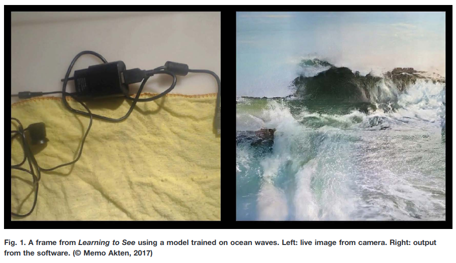

----
Fiche créée par Guillaume D.Isabelle, 2020 
---- 

### HashTagged 

## **Dans le input (traduire; données d'entrée ?!) et dans le output (traduire; résultat en sortie ?!), on reconnait la composition et un ensemble de forme et de structure**

>reconstructs a new image that resembles the input in composition and overall shape and structure

### (p. 1) 

## La recherche de Atken démontre que l'entraînement est un élément critique qui influence les prédictions que le modèle fera.

>[...] demonstrating how critical the training data is to the predictions that the model will make

### (p. 1) 

----

----

# Learning to see: you are what you see

|       |       |       |
|  ---  |  ---  |  ---  |
|   [ZotWeb](http://zotero.org/users/180474/items/IN9DFCGU)    | paper-conference      |       |
|   [Src Url](http://doi.org/10.1145/3306211.3320143)    |  [[Akten]], [[Fiebrink]], [[Grierson]] (2019)     |       |
|       |       |       |

## Abstract

The authors present a visual instrument developed as part of the creation of the artwork Learning to See. The artwork explores bias in artificial neural networks and provides mechanisms for the manipulation of specifically trained-for real-world representations. The exploration of these representations acts as a metaphor for the process of developing a visual understanding and/or visual vocabulary of the world. These representations can be explored and manipulated in real time, and have been produced in such a way so as to reflect specific creative perspectives that call into question the relationship between how both artificial neural networks and humans may construct meaning.

----

## Annotations

Learning to See
===============

real-world representations

We use a novel training system and custom software

reconstructs a new image that resembles the input in composition and overall shape and structure

demonstrating how critical the training data is to the predictions that the model will make

Metaphorically speaking, the training data determines the full life experience of the network and ultimately shapes its worldview

build hierarchies of representations and extract meaningful information from vast amounts of high-dimensional raw dat

are not focusing on the potential of DL systems as a real-time human-machine collaborative tool or instrumen

We design our system to enable users to create what can be thought of as animated content, in a real-time, interactive manner

digital puppetry

The second form of real-time interactivity comes through a number of parameters (which can be controlled via a MIDI controller, or a graphical user interface [GUI] ) that influence how the output image is reconstructed

Network Architecture and Training

We might even go as far as to claim that the model contains knowledge of the structure of elements related to the contents of the dataset.

 [...] offer a range of potential creative affordances

#goal  
[[AIGoal]] 

m.akten@gold.ac.uk  
[[AIContact]] 

The exploration of these representations acts as a metaphor for the process of developing a visual understanding and/or visual vocabulary of the world.

Akten

Learning to See: You Are What You See
=====================================

----

----

### Section analyse structurée en grille (SAGrid)

# NOT SAGrid output

# Q

