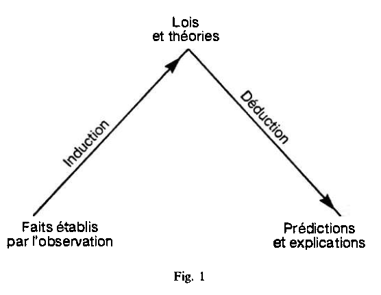
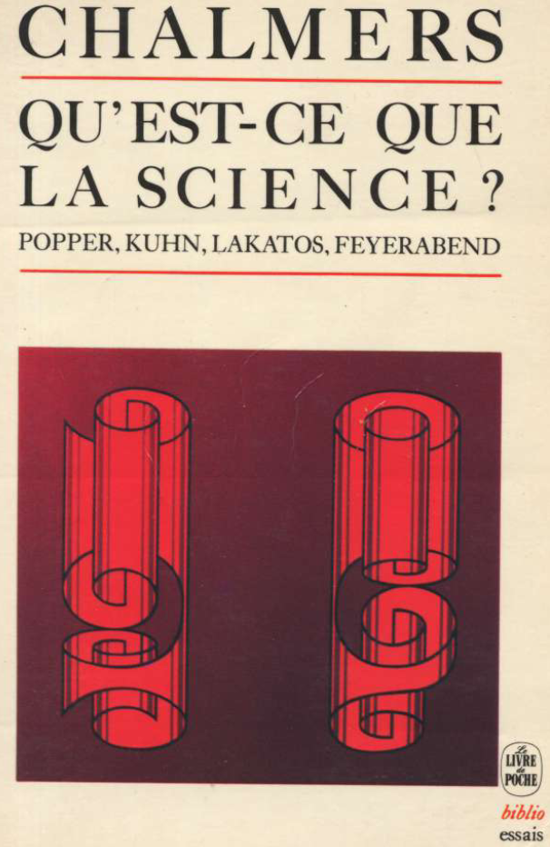

----
Fiche créée par Guillaume D.Isabelle, 2020 
---- 

### HashTagged 

### Section carte de lecture polaire

----

----

### Section annotation polaire
**L'étude du raisonnement déductif constitue l'objet de la logique**

  

_On considère parfois la logique comme incluant l'étude du raisonnement inductif, de sorte qu "il existerait une logique inductive à côté d"une logique déductive. Dans cc livre, la logique est entendue au sens du raisonnement déductif exclusivement._

**CHALMERS**

  

---------------------------------------------------------

Citer: (Chalmers, 1990)

FTag: Chalmers-1990

APA7: Chalmers, A. F. (1990). _Qu’est-ce que la science ?_ 292.

-----------------------------------------------------------------------

Qu'est-ce que la science?
=========================

Ce type de raisonnement qui, à partir d'une série finie d'énoncés singuliers, aboutit à légitimer un énoncé universel, qui fait **passer du particulier au général,** est appelé raisonnement inductif, le processus lui-même étant l'induction.

2\. L'inductivisme naïf
=======================

----

----

### Section analyse structurée en grille (SAGrid)

# NOT SAGrid output

# Q

