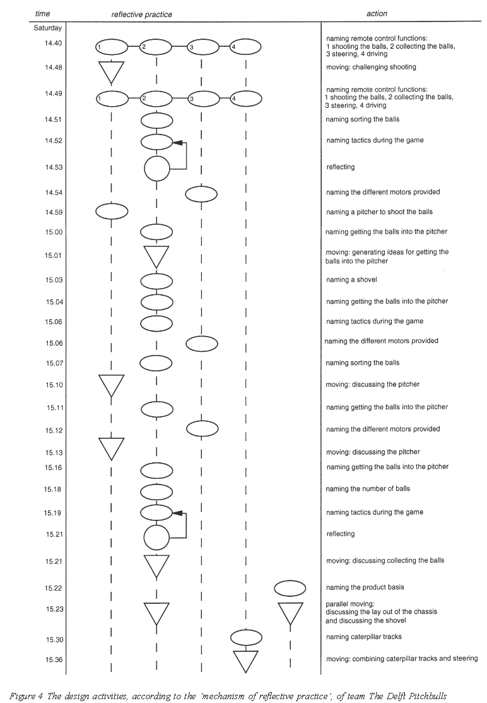
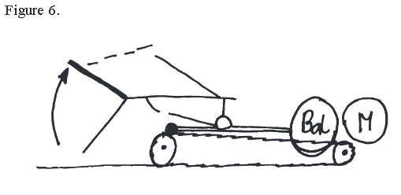
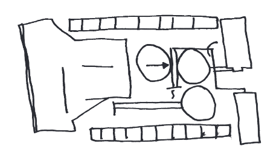
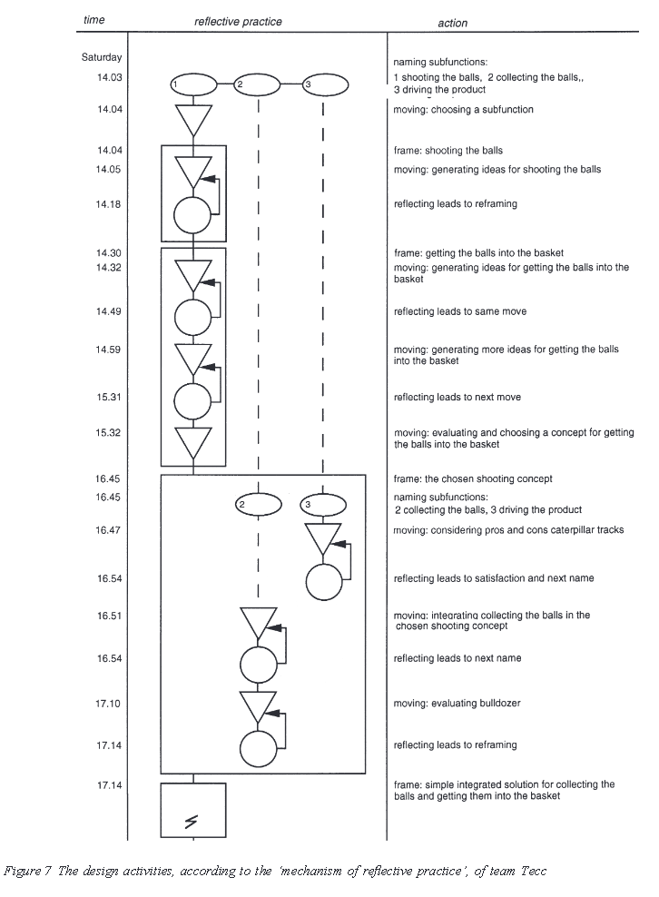
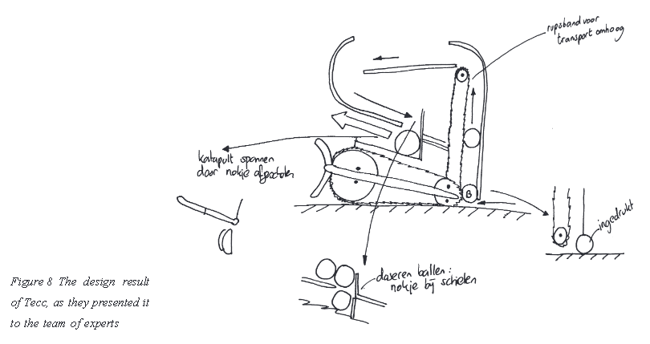
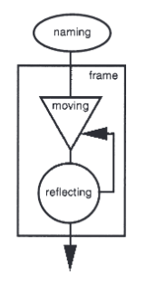

# The Reflective Practitioner : How Professionals Think in Action
|       |       |       |
|  ---  |  ---  |  ---  |
|   [ZotWeb](http://zotero.org/users/180474/items/KY3RPVEQ)    | book      | [Src Url](https://www.taylorfrancis.com/books/9781315237473)      |
|       |       |       |
|       |       |       |

The reflective practice of design teams

Citer: (Valkenburg & Dorst, 1998)

FTag: Valkenburg-Dorst-1998

APA7:  Valkenburg, R., & Dorst, K. (1998). The reflective practice of design teams. _Design Studies_, _19_(3), 249–271. [https://doi.org/10.1016/S0142-694X(98)00011-8](https://doi.org/10.1016/S0142-694X(98)00011-8)

**Keywords**: design activity, teamwork, reflection-in-action, protocol analysis, research method  
  
**Mots clés**: activité de conception, travail en équipe, réflexion en action, analyse de protocole, méthode de recherche

**-------------------------------------------------------**

**Schon’s paradigm of reflective practice**

**-------------------------------------------------------**  
  [[Schon]] | 

explain the relation between the protocol and the description of the team according to the mechanism of reflective practice

all the interesting moments occurred when the team makes a **transition** between frames

to improve design theory and education systematically we need to make a transition from this pure description to prescription. We need to further analyze and discuss the general patterns that occur in the described team  
  
#limite

3\. 4 Team ‘Tecc’

------------------------------------------------------------

3 The reflective practice of the teams
======================================

four activities (naming, framing, moving and reflecting) and their relations: the ‘mechanism of reflective practice’. The designers start by naming the relevant issues in the design situation, framing the problem in a certain way, making moves towards a solution, and reflecting on those moves and the current frame.

  

**#CT**

**4 Activities**

*** Naming**

*** Framing**

*** Moving**

*** Reflecting**  
  [[Schon]] | 

develop tools and guidelines to improve team design practice

understand

analyze and describe

new description method, based on Schon’s theory of reflective practice

**#metho #results**

This method was tested by applying it in the description of the activities of two design teams. The description method proves to be very useful, in that it allows a concise description of a design project in which the elements vital to the understanding of the design progress are conserved

**#metho**

Comparing the obtained descriptions of these two teams designing reveals different patterns of behaviour

**#results**

in-depth analysis of team design behaviour.

**#objectives**

**“a kind of knowing is inherent in intelligent action”** _(Schön, 2017. p. 50)_

 [...] implicit knowledge cannot be described within the prevalent methodological paradigm of technical rationality.

**#problematic**

implicit ‘knowing-in-action’ is difficult to describe

**#problematic**

explicit reflection that guides the development of one’s knowing-in- action habits.  This he calls **reflection-in-action.**

**#CT**

Scho ̈ n’s theory is based on a constructionis

 [...] little of the research methods currently used in design methodology is suited for our purposes. The com- plexity of design has always made it difficult to study real life design activity, and none of the existing research methods to observe and describe designing provides us with data that is rich enough, in that it spans both the design process and relevant aspects of the design context.

  

#**problematic**

basic elements of design activities are actions

Schon’s theory is based on a **constructionist** view of human perception and thought processes: through the execution of ‘move-testing experiments’ (involving action and reflection), a designer is actively constructing a view of the world based on his/her experiences.

  

**#CT**

----

----

