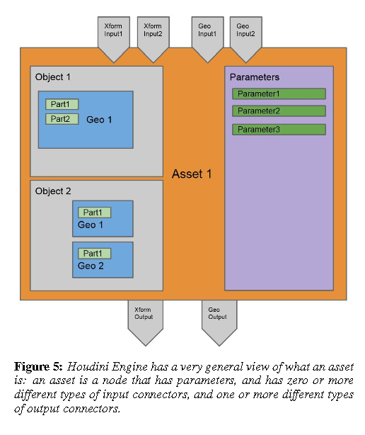

# Houdini engine: evolution towards a procedural pipeline

|       |       |       |
|  ---  |  ---  |  ---  |
|   [ZotWeb](http://zotero.org/users/180474/items/W4A6AF9C)    | paper-conference      |       |
|   [Src Url](http://doi.org/10.1145/2633374.2633378)    |  [[Xu]], [[Campeanuy]] (2014)     |       |
|       |       |       |

## Abstract

Proceduralism has become increasingly important to both film and game pipelines. By utilizing procedural approaches, production teams in both film and games can significantly reduce timelines and enhance flexibility. In recent years, due to the increasing demand on gaming pipelines to provide ever increasing amounts of content, and the need to retain revisability of content late into the production cycle, procedural approaches have been gaining traction in gaming pipelines as well. Houdini is a software package known for its procedural approach. However, Houdini's core technology was rather inaccessible because its workflows and interfaces weren't familiar to many artists. Houdini Engine was a project to make Houdini's core technology easier to integrate with other software. This paper details its evolution, where we focus on the many technical decisions and challenges that we had to face along the way, detailing some of the reasoning and tradeoffs behind our software design choices.

----

## Annotations

Houdini Engine: Evolution Towards a Procedural Pipeline  [(Xu & Campeanuy, 2014)](https://www.zotero.org/google-docs/?PXkeiQ)

Proceduralism has become increasingly important to both film and game pipelines

procedural network acts like a recipe

node network

Users work by placing and connecting these nodes into networks. Data flows top down, from one node to another, and each node modifies the data and then passes the modified data onto the next node

get- ting the results out of Houdini proved problematic.

epresentations of every- thing from lights, to cameras, to meshes, volumes, skeletons, skin information and so on

Asset Abstraction

API Form Factor

The Value is in the Recipe

Loose vs. Tight Coupling

String Handles

Host Complexities

----

----

